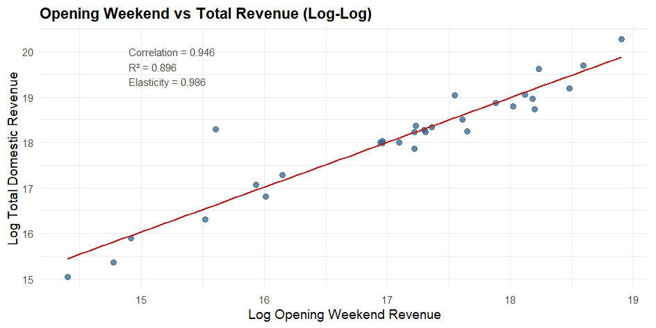
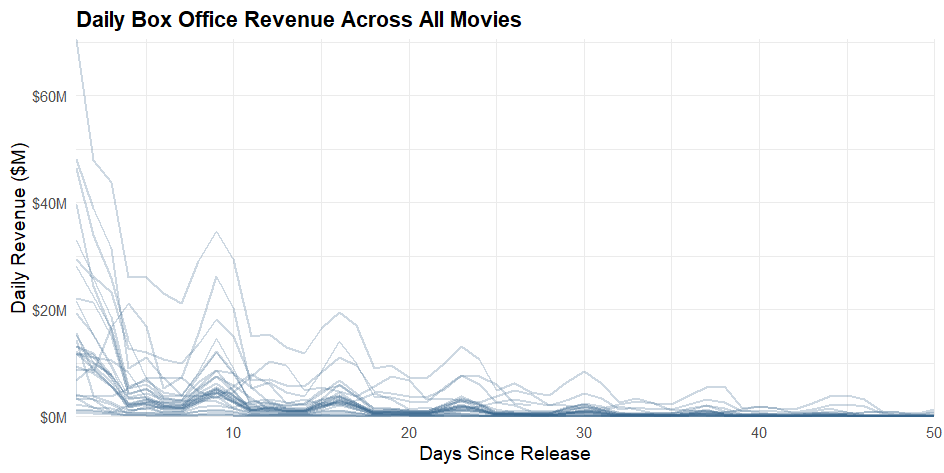
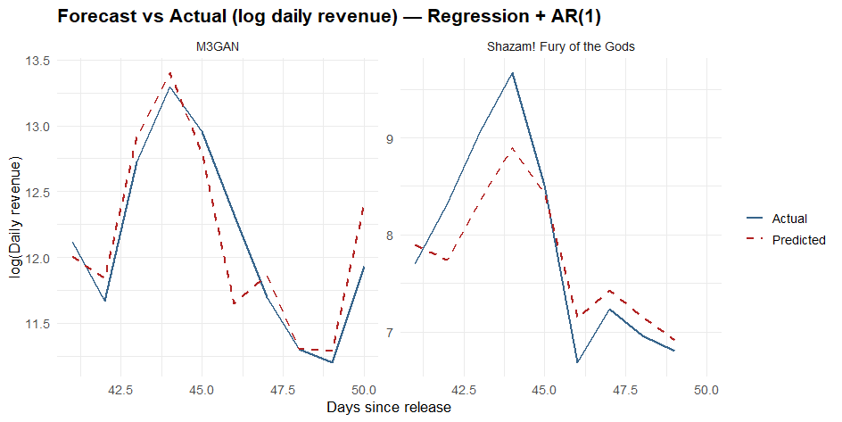

# Predicting Domestic Box Office Revenue
 
**Forecasting a film's total box office gross from its early performance, using cross-sectional regression and time-series modeling.**
 
How well does a film's opening predict how much it earns over its full run? Using 30 wide-release films from 2023 and ~2,300 daily revenue observations, this project builds two complementary models: a cross-sectional regression that links early revenue to total gross, and a regression + AR(1) time series model that captures how daily revenue evolves day to day. The headline result: **opening weekend alone explains ~91% of the variation in total domestic revenue**, with an elasticity close to 1 (a 1% bigger opening lines up with roughly a 1% bigger total).
 
> Originally completed as an econometrics final project (Econ 423). Reframed here as a forecasting case study.
 
---
 
## Key Results
 
| Question | Finding |
|---|---|
| Does early revenue predict total gross? | Yes: opening weekend explains **~91%** of the variation across films (elasticity ≈ 1.0) |
| Do franchise / budget / runtime add anything? | No: none are statistically significant once opening weekend is included |
| Which early window predicts best? | Week 2 is the single strongest in-sample (R² = 0.987); Weeks 1–2 together carry almost all the signal |
| Best daily-revenue model? | **Regression + AR(1)** — lowest out-of-sample error (RMSE), beating more complex ARMA models |
 
---
 
## Approach
 
**1. Cross-sectional model.** A log-log regression of total domestic gross on opening-weekend revenue, then extended with franchise, budget, and runtime controls plus a franchise interaction term. The log transforms handle the heavy right-skew (a few huge hits stretch the data), which is well documented in the box-office literature (De Vany & Walls, 1999).
 
**2. Early-window comparison.** Separate log-log regressions on Day 1, Week 1, Week 2, and Week 3 revenue, then a combined model — to pin down exactly which early window carries the predictive power.
 
**3. Time-series model.** Instead of differencing the series (which made the variance worse here), the trend and the day-of-week pattern are removed with a regression, leaving stationary residuals. Those residuals are then modeled with AR/ARMA specifications; AR(1) comes out on top on both AIC and BIC.
 
**4. Out-of-sample validation.** The full model is trained on the **first 14 days** (two weeks, matching the window that drives the cross-sectional results) of two held-out films — *M3GAN* and *Shazam! Fury of the Gods* — and used to **forecast through day 50**. Six candidate residual-dynamics specifications are then compared on forecast error (RMSE/MAE).
 
---
 
## Selected Figures
 
<!-- IMAGE PLACEHOLDER 1
   Use Figure 4 from the PDF (page 7): "Opening Weekend vs Total Revenue (Log-Log)" scatter.
   Screenshot it, save as images/log_log_scatter.png -->

*Opening weekend vs. total domestic revenue (log-log). Correlation 0.946, R² 0.896, elasticity 0.986.*
 
<!-- IMAGE PLACEHOLDER 2
   Use Figure 3 from the PDF (page 6): "Daily Box Office Revenue Across All Movies" (first 50 days).
   Save as images/daily_revenue_all_films.png -->

*Daily revenue, first 50 days — a sharp drop after release plus a repeating weekly weekend bump.*
 
<!-- IMAGE PLACEHOLDER 3
   Use the forecast plot from the PDF (page 19): "Forecast vs Actual (log daily revenue) — Regression + AR(1)".
   Save as images/forecast_vs_actual.png -->

*Out-of-sample forecast vs. actual under the Regression + AR(1) model.*
 
---
 
## Repository Structure
 
```
.
├── README.md
├── analysis.R                  # Full pipeline: figures, regressions, time-series models
├── report/
│   └── Final_Project.pdf       # Full write-up with all tables and figures
├── data/
│   ├── dataset_1_movies.csv    # Movie-level (30 films): opening, total, franchise, budget, runtime
│   └── dataset_2_daily.csv     # Daily-level (~2,300 obs): daily gross by film and day
└── images/                     # Figures for this README
```
 
> **Note:** the raw datasets are not redistributed here. They were collected from [The Numbers](https://www.the-numbers.com/). `analysis.R` expects `dataset_1_movies.csv` and `dataset_2_daily.csv` in the working directory.
 
---
 
## Running It
 
```r
# Install dependencies (first run only)
install.packages(c("readr","dplyr","ggplot2","scales","moments","forecast","tidyr"))
 
# Set the working directory to the folder containing the two CSVs, then:
source("analysis.R")
```
 
`analysis.R` is split into labeled sections that line up one-to-one with the figures and tables in the report (distributions → cross-sectional model → early-window comparison → detrending → residual dynamics → out-of-sample forecast).
 
---
 
## Tech
 
`R` · `forecast` (ARIMA / auto.arima) · `dplyr` · `ggplot2` · OLS regression · ARMA modeling · log-log elasticity estimation · out-of-sample backtesting
 
## References
 
- De Vany, A. & Walls, W. D. (1999). *Uncertainty in the Movie Industry.* Journal of Cultural Economics.
- Eliashberg, J., Elberse, A. & Leenders, M. (2006). *The Motion Picture Industry.* Marketing Science.
- Walls, W. D. (2005). *Modelling Movie Success when "Nobody Knows Anything".* Journal of Cultural Economics.
 
